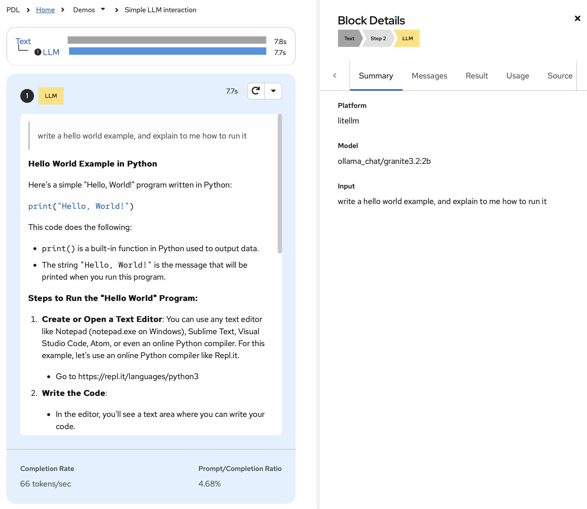
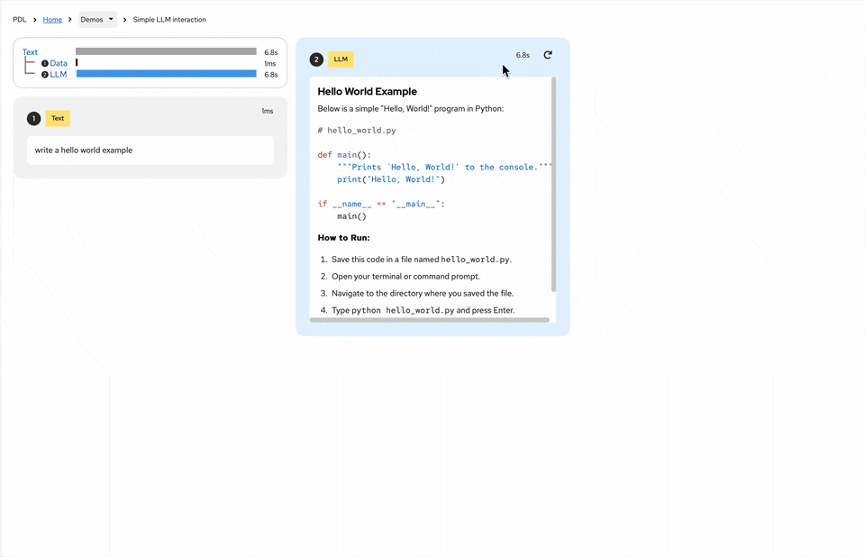
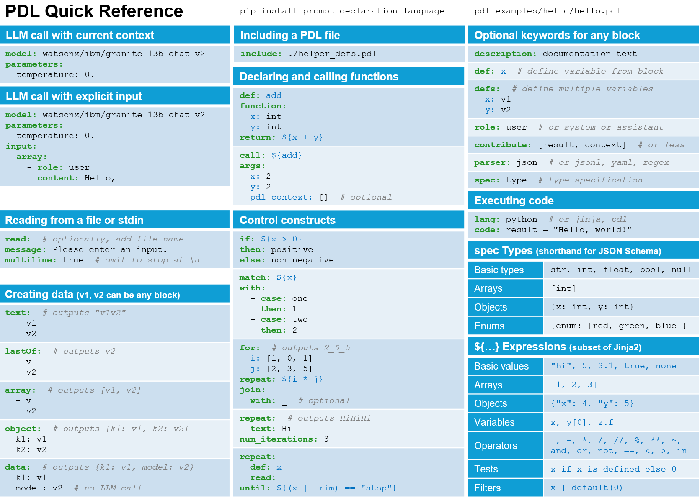

# PDL (Prompt Declaration Language)

[](https://github.com/IBM/prompt-declaration-language/actions?query=workflow%3Abuild+branch%3Amain)
[](https://github.com/IBM/prompt-declaration-language/actions?query=workflow%3Arun-examples+branch%3Amain)
[](https://github.com/IBM/prompt-declaration-language/actions?query=workflow%3Amkdocs-gh-pages+branch%3Amain)
[](https://pypi.python.org/pypi/prompt-declaration-language/)
[](https://github.com/IBM/prompt-declaration-language/actions/workflows/publish-quay.yaml)
[](https://pycqa.github.io/isort/)
[](https://github.com/psf/black)
[](https://github.com/PyCQA/pylint)
[](https://github.com/PyCQA/bandit)
[](https://opensource.org/licenses/Apache-2.0)
[](https://bestpractices.coreinfrastructure.org/projects/9672)

PDL is a declarative language designed for developers to create reliable, composable LLM prompts and integrate them into software systems. It provides a structured way to specify prompt templates, enforce validation, and compose LLM calls with traditional rule-based systems.

[**Quick Start**](#quick-start) **|** [**Example**](#example-program-a-basic-llm-call) **|** [**GUI**](#graphical-experience) **|** [**Key Features**](#key-features) **|** [**Documentation**](#documentation) **|** [**API Cheat Sheet**](#api-cheat-sheet)

## Quick Start

A PDL program is written *declaratively*, in YAML. The `pdl` command
line tool interprets this program, accumulating messages and sending
them to the models as specified by your program. PDL supports both
hosted and local models. See
[here](https://ibm.github.io/prompt-declaration-language/tutorial/#using-ollama-models)
for instructions on how to install an Ollama model locally.

To install the `pdl` command line tool:

```bash
pip install prompt-declaration-language
```

## Example Program: A Basic LLM Call



The following program accumulates a single message `write a hello
world example…` and sends it to the `ollama/granite-3.2:8b` model:

```yaml
text:
- "write a hello world example, and explain how to run it"
- model: ollama/granite-3.2:8b
```

To run this program:

```bash
pdl <path/to/example.pdl>
```

For more information on the `pdl` CLI see
[here](https://ibm.github.io/prompt-declaration-language/). To try the
screenshot on the right live, click
[here](https://pdl.s3-web.us-east.cloud-object-storage.appdomain.cloud/#/demos/Simple%20LLM%20interaction).

## Graphical Experience

The screenshot on the right (above) shows PDL's graphical user
interface. This GUI allows for interactive debugging and live
programming. You may install this via `brew install pdl` on MacOS. For
other platforms, downloads are available
[here](https://github.com/IBM/prompt-declaration-language/releases/latest). You
may also kick the tires with a web version of the GUI
[here](https://pdl.s3-web.us-east.cloud-object-storage.appdomain.cloud/).

To generate a trace for use in the GUI:
```bash
pdl --trace <file.json> <my-example.pdl> 
```




## Key Features

- **LLM Integration**: Compatible with any LLM, including IBM watsonx
- **Prompt Engineering**: 
  - Template system for single/multi-shot prompting
  - Composition of multiple LLM calls
  - Integration with tools (code execution & APIs)
- **Development Tools**:
  - Type checking for model I/O
  - Python SDK
  - Chat API support
  - Live document visualization for debugging
- **Control Flow**: Variables, conditionals, loops, and functions
- **I/O Operations**: File/stdin reading, JSON parsing
- **API Integration**: Native REST API support (Python)

## Documentation

- [Documentation](https://ibm.github.io/prompt-declaration-language/)
- [Tutorial](https://ibm.github.io/prompt-declaration-language/tutorial/)
- [API References](https://ibm.github.io/prompt-declaration-language/api_reference/)


### API Cheat Sheet




## Installation Details

PDL requires Python 3.11+ (Windows users should use WSL).

```bash
# Basic installation
pip install prompt-declaration-language

# Development installation with examples
pip install 'prompt-declaration-language[examples]'
```

### Environment Setup

You can run PDL with LLM models in local using [Ollama](https://ollama.com), or other cloud service.
See [here](https://ibm.github.io/prompt-declaration-language/tutorial/#using-ollama-models) for 
instructions on how to install an Ollama model locally.

If you use watsonx:
```bash
export WX_URL="https://{region}.ml.cloud.ibm.com"
export WX_API_KEY="your-api-key"
export WATSONX_PROJECT_ID="your-project-id"
```

If you use [Replicate](https://replicate.com/):
```bash
export REPLICATE_API_TOKEN="your-token"
```

### IDE Configuration 

Install the `YAML Language Support by Red Hat` extension in VSCode.
VSCode setup for syntax highlighting and validation:

```json
// .vscode/settings.json
{
    "yaml.schemas": {
        "https://ibm.github.io/prompt-declaration-language/dist/pdl-schema.json": "*.pdl"
    },
    "files.associations": {
        "*.pdl": "yaml",
    }
}
```

## Code Examples

### Variable Definition & Template Usage

In this example we use external content _data.yaml_ and watsonx as an LLM provider.

```yaml
description: Template with variables
defs:
  user_input:
    read: ../code/data.yaml
    parser: yaml
text:
- model: watsonx/ibm/granite-34b-code-instruct
  input: |
    Process this input: ${user_input}
    Format the output as JSON.
```

### Python Code Integration

```yaml
description: Code execution example
text:
- "\nFind a random number between 1 and 20\n"
- def: N
  lang: python
  code: |
    import random
    # (In PDL, set `result` to the output you wish for your code block.)
    result = random.randint(1, 20)
- "\nthe result is (${ N })\n"
```

### Chat

chat interactions:

```yaml
description: chatbot
text:
- read:
  def: user_input
  message: "hi? [/bye to exit]\n"
  contribute: [context]
- repeat:
    text:
    - model: ollama/granite-code:8b
    - read:
      def: user_input
      message: "> "
      contribute: [context]
  until: ${ user_input == '/bye'}
```


## Trace Telemetry

PDL includes experimental support for gathering trace telemetry.  This can
be used for debugging or performance analysis, and to see the shape of prompts sent by LiteLLM to models.

For more information see [here](https://github.com/IBM/prompt-declaration-language/blob/main/docs/telemetry.md).


## Contributing

See the [contribution guidelines](https://ibm.github.io/prompt-declaration-language/contrib) for details on:
- Code style
- Testing requirements
- PR process
- Issue reporting

## References

- [PDL Schema](https://github.com/IBM/prompt-declaration-language/blob/main/src/pdl/pdl-schema.json)
- [arXiv Paper](http://arxiv.org/abs/2410.19135)

