# Concretely Speaking, What is a Span Query?

A span query can be considered as an abstract syntax tree (AST) where
each leaf node is a message (i.e. some kind of content to be sent to
the model) and each interior node is either a `g` (indicating that new
content should be generated) or a *data dependence* operator (`x` or
`+`) that describe how the messages depend on eachother.

- Each `g` sends messages to a model for generation.
- Each `+` ("plus") indicates that the given arguments are
independent; think of this as a data-parallel map, with the additional
property that models can interpret the arguments in such a way as not
to have the given tokens co-attend.
- Each `x` ("cross") indicates that the given arguments are dependent;
think of this as a data-parallel reduce, where models must have the
given tokens attend to eachother. As with a data-parallel reduce,
`cross` has two sub-variants depending on whether or not the reduce is
*commutative*.
- Leaf nodes are either system or user messages. Below we may shorten
  these to `s` and `u`.

```mermaid
flowchart TD
        g1((g)) --> x1((x))
        x1 --> s1((s))
        x1 --> p1((＋))
        x1 --> u1((u))
        p1 --> g2((g))
        p1 --> g3((g))
        p1 --> g4((g))
        p1 --> g5((g))
        g2 --> u2((u))
        g3 --> u3((u))
        g4 --> u4((u))
        g5 --> u5((u))

        classDef g fill:#e4f6ff
        classDef x fill:#ff8389
        classDef p fill:#ffd8d9
        classDef s fill:#d4a104
        classDef u fill:#fddc68
        class g1,g2,g3,g4,g5 g
        class x1 x
        class p1 p
        class s1 s
        class u1,u2,u3,u4,u5 u
```



## A Prototype DSL for Span Queries

To explore this space, we use a simple LISP-like DSL to allow directly
injecting the internal representation into the span query planner and
runner:

- `(g model input)`: Used to ask a model to generate new output.
- `(plus d1 d2 ...)`: Used to signify that the given items `d1`, `d2`,
  ... are to be considered independent of eachother.
- `(cross d1 d2 ...)`: Ibid, except now the items are to be considered
  as having a linear dependence on eachother.

### Helpers: ask, file, repeat, format
In addition to these three core operators, the DSL offers some helpful
syntactic sugarings. These include `(ask message)` which prompts the
user for a message, `(file filepath)` which reads in a string from the
given local file path, and `(repeat n <subquery>)` which expands the
given subquery `n` times.

### Examples:

This will generate (`g`) some output, using the given "model server/model", provided with the given input "Hello world":
```lisp
(g "ollama/granite3.2:2b" "Hello world")
```

Same, except ask the user (or read from a file) which prompt should be send to the generation.
```lisp
(g "ollama/granite3.2:2b" (read "What should I ask the model?"))
(g "ollama/granite3.2:2b" (file "./prompt.txt"))
```

Send a sequence of prompts to the model:
```lisp
(g "ollama/granite3.2:2b" (cross (read "What should I ask the model?")  (file "./prompt.txt")))
```

The `g` operator also accepts optional max tokens and temperature
options. Here analyze three independent inputs, each generated with
max tokens of 1000 and a temperature of 0.3:
```lisp
(g "ollama/granite3.2:2b"
   (cross "Pick the best one"
          (plus (g "ollama/granite3.2:2b" "Generate a fun email" 1000 0.3)
                (g "ollama/granite3.2:2b" "Generate a fun email" 1000 0.3)
                (g "ollama/granite3.2:2b" "Generate a fun email" 1000 0.3))))
```
